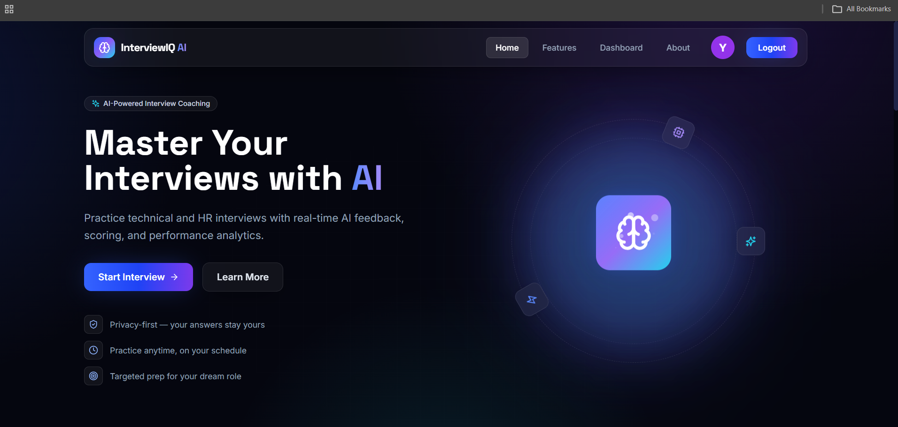
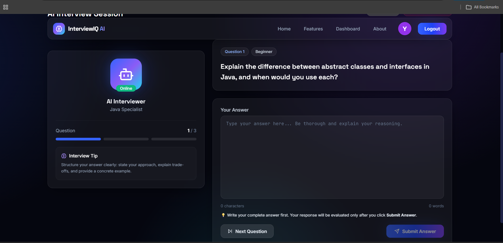
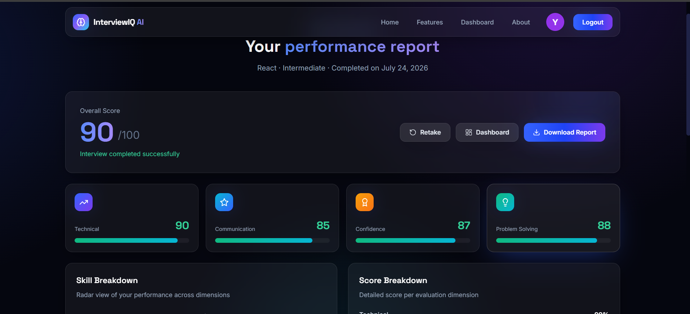
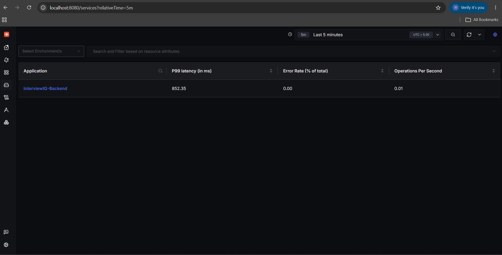
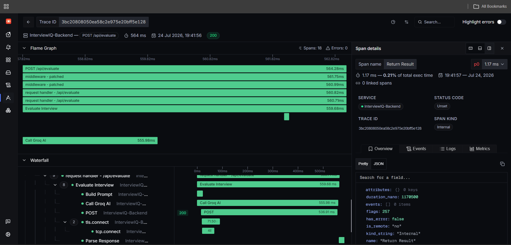
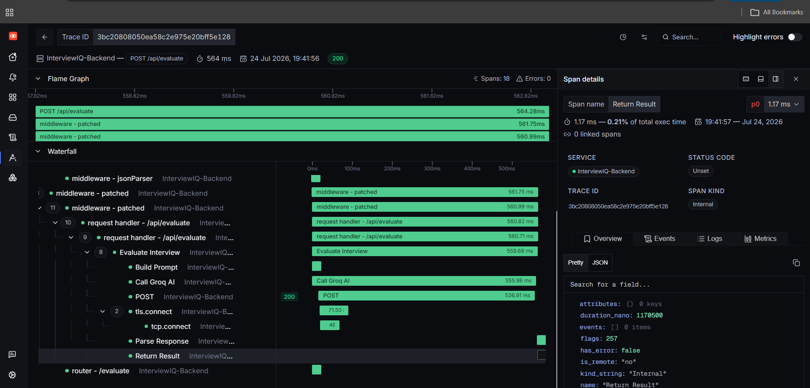

# 🤖 InterviewIQ AI

> **AI-powered mock interview platform with real-time observability using OpenTelemetry and SigNoz.**



---

## 🚀 Project Overview

InterviewIQ AI is an AI-powered technical interview platform that helps users prepare for software engineering interviews by evaluating their answers using **Groq's Llama 3.3 70B model**.

To improve reliability and debugging, the backend is instrumented with **OpenTelemetry** and integrated with **SigNoz**, allowing developers to monitor every interview request through distributed traces, flame graphs, waterfall views, latency metrics, and error tracking.

---

## ✨ Key Features

- 🎤 AI-powered mock technical interviews
- 🧠 Intelligent answer evaluation using Groq Llama 3.3
- 📊 Detailed score, strengths, weaknesses, and personalized feedback
- ⚡ Fast Node.js + Express backend
- 📡 Automatic OpenTelemetry instrumentation
- 📈 Real-time distributed tracing with SigNoz
- 🔥 Flame Graph & Waterfall visualization
- 🚨 Error monitoring and debugging
- 📉 Request latency monitoring
- 💡 Clean and modern React user interface

---

# 🏗️ Project Architecture

```
                 User
                   │
                   ▼
          React Frontend (Vite)
                   │
                   ▼
          Express Backend (Node.js)
                   │
        ┌──────────┴──────────┐
        │                     │
        ▼                     ▼
   Groq Llama 3.3      OpenTelemetry SDK
        │                     │
        └──────────┬──────────┘
                   ▼
                SigNoz
         (Tracing & Monitoring)
```

---

# 🛠️ Tech Stack

### Frontend

- React
- TypeScript
- Vite
- Tailwind CSS

### Backend

- Node.js
- Express.js

### Artificial Intelligence

- Groq API
- Llama 3.3 70B Versatile

### Observability

- OpenTelemetry
- SigNoz
- OTLP HTTP Exporter

---

# 📸 Application Screenshots

## 🏠 Home Page


---

## 🎤 Interview Screen



---

## 📊 AI Evaluation Result



---

# 📈 SigNoz Observability

The backend automatically exports telemetry data to SigNoz using the OpenTelemetry Node SDK.

Each interview request generates multiple spans that allow developers to understand the complete execution flow of every API request.

---

## 📌 Services Dashboard



Displays all instrumented backend services detected by SigNoz.

---

## 📌 Trace Details


Shows every request with execution time and complete trace information.

---

## 📌 Flame Graph



Visualizes where execution time is spent inside the application.

---

## 📌 Waterfall View



Displays the complete request lifecycle from start to finish.

---

# 🔍 OpenTelemetry Integration

The backend is instrumented using the **OpenTelemetry Node SDK**.

Every interview request automatically generates spans including:

- 🟢 Build Prompt
- 🤖 Call Groq AI
- 📄 Parse Response
- 📤 Return Result

These spans are exported through the **OTLP HTTP Exporter** to SigNoz for visualization and performance monitoring.

---

# 📊 Why SigNoz?

Using SigNoz provides valuable insights into backend performance by enabling:

- Distributed Tracing
- Performance Monitoring
- Request Latency Analysis
- Error Tracking
- Flame Graph Visualization
- Waterfall Timeline Analysis
- API Debugging
- End-to-End Request Visibility

This makes identifying slow operations and debugging backend issues significantly easier.

---

# 🚀 Running the Project

## Clone Repository

```bash
git clone <your-repository-url>
cd InterviewIQ-AI
```

---

## Frontend

```bash
npm install
npm run dev
```

---

## Backend

```bash
cd backend
npm install
npm run dev
```

---

## Start SigNoz

```bash
cd deployment
docker compose up -d
```

Open:

```
http://localhost:8080
```

---

# 📊 Viewing Traces in SigNoz

1. Start SigNoz.
2. Start the backend server.
3. Open the InterviewIQ application.
4. Submit interview answers.
5. Open SigNoz.
6. Navigate to:

```
Services
    ↓
InterviewIQ-Backend
    ↓
Traces
```

There you can inspect:

- Trace Timeline
- Flame Graph
- Waterfall View
- Individual Spans
- Request Duration
- Error Details

---

# 📂 Project Structure

```
InterviewIQ-AI
│
├── backend
│   ├── server.js
│   ├── evaluate.js
│   ├── tracing.js
│   └── package.json
│
├── src
│
├── screenshots
│   ├── home.png
│   ├── interview.png
│   ├── result.png
│   ├── services.png
│   ├── trace-details.png
│   ├── flame-graph.png
│   └── waterfall.png
│
└── README.md
```

---

# 🚀 Future Improvements

- 🎙️ Voice-based interviews
- 🌍 Multi-language interview support
- 👤 User authentication
- 📚 Interview history
- 📄 Resume-based interview generation
- 📈 Performance analytics dashboard

---

# 👩‍💻 Author

**Yamini Kotturi**

Built for the **SigNoz Hackathon 2026** using **React, Node.js, Groq, OpenTelemetry, and SigNoz**.

⭐ If you found this project interesting, consider giving it a star!